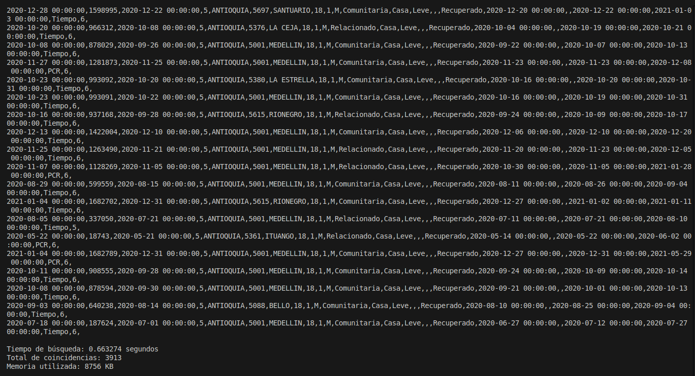

# Práctica de Búsqueda de Casos COVID-19

### Realizado por:
1. **Ana María González H**  
   **Correo**: anagonzalezhe@unal.edu.co

2. **Justin Rodriguez Sanchez**  
   **Correo**: jusrodriguez@unal.edu.co

## Especificaciones por dataset

### Descripción detallada de los campos del dataset seleccionado

1. **Fecha reporte web**  
   **Descripción**: Fecha de publicación en el sitio web.

2. **ID de caso**  
   **Descripción**: Identificador único para cada caso reportado.

3. **Fecha de notificación**  
   **Descripción**: Fecha en que el caso fue notificado al sistema de vigilancia SIVIGILA.

4. **Código DIVIPOLA departamento**  
   **Descripción**: Código del departamento según el sistema DIVIPOLA, utilizado para la clasificación geográfica.

5. **Nombre departamento**  
   **Descripción**: Nombre del departamento donde se registró el caso.

6. **Código DIVIPOLA municipio**  
   **Descripción**: Código del municipio según el sistema DIVIPOLA, utilizado para la clasificación geográfica.

7. **Nombre municipio**  
   **Descripción**: Nombre del municipio donde se registró el caso.

8. **Edad**  
   **Descripción**: Edad del paciente en años, meses o días, según corresponda.

9. **Unidad de medida de edad**  
   **Descripción**: Unidad de medida utilizada para registrar la edad del paciente: 1-Años, 2-Meses, 3-Días.

10. **Sexo**  
    **Descripción**: Género del paciente: Masculino o Femenino.

11. **Tipo de contagio**  
    **Descripción**: Tipo de contagio: relacionado, importado, en estudio o comunitario.

12. **Ubicación del caso**  
    **Descripción**: Indica la ubicación del paciente, ya sea en hospitalización o en recuperación, y si está relacionado o no con el COVID-19.

13. **Estado**  
    **Descripción**: Estado del paciente: activo, recuperado, fallecido, etc.

14. **Código ISO del país**  
    **Descripción**: Código del país según la norma ISO, en caso de que el caso haya sido notificado desde otro país.

15. **Nombre del país**  
    **Descripción**: Nombre del país de residencia del paciente o donde se notificó el caso.

16. **Recuperado**  
    **Descripción**: Estado del paciente en cuanto a su recuperación: Recuperado, Fallecido o N/A (vacío para casos activos).

17. **Fecha de inicio de síntomas**  
    **Descripción**: Fecha en que el paciente comenzó a mostrar síntomas del COVID-19.

18. **Fecha de muerte**  
    **Descripción**: Fecha en que el paciente falleció, si aplica.

19. **Fecha de diagnóstico**  
    **Descripción**: Fecha en que el caso fue confirmado por laboratorio.

20. **Fecha de recuperación**  
    **Descripción**: Fecha en que el paciente se recuperó, si aplica.

21. **Tipo de recuperación**  
    **Descripción**: Tipo de recuperación del paciente: PCR (segundo negativo en prueba) o Tiempo (30 días sin síntomas o sin hospitalización).

22. **Pertenencia étnica**  
    **Descripción**: Grupo étnico al que pertenece el paciente, con opciones como Indígena, ROM, Raizal, Palenquero, Negro, o Otro.

23. **Nombre del grupo étnico**  
    **Descripción**: Nombre específico del grupo étnico al que pertenece el paciente.

---

## Rangos de valores válidos para cada campo de entrada

1. **Primer Criterio (Departamento)**  
   Los departamentos válidos para este campo son los siguientes:

   - Amazonas
   - Antioquia
   - Arauca
   - Atlántico
   - Bolívar
   - Boyacá
   - Caldas
   - Caquetá
   - Casanare
   - Cauca
   - Cesar
   - Chocó
   - Córdoba
   - Cundinamarca
   - Guaviare
   - Guainía
   - Huila
   - La Guajira
   - Magdalena
   - Meta
   - Nariño
   - Norte Santander
   - Putumayo
   - Quindío
   - Risaralda
   - San Andrés
   - Santander
   - Sucre
   - Tolima
   - Valle del Cauca
   - Vaupés
   - Vichada

2. **Segundo Criterio (Edad)**  
   Los valores válidos para este campo son números enteros entre 0 y 110 años.

3. **Tercer Criterio (Sexo)**  
   Los valores válidos para este campo son:
   - **M**: Masculino
   - **F**: Femenino

---

## Justificación de los Criterios de Búsqueda Implementados

1. **Departamento (`nombredepartamento`)**:  
   **Justificación**: El **nombre del departamento** es un criterio clave para filtrar los datos por ubicación. Al buscar por departamento, se puede identificar qué regiones tienen más casos o cuáles necesitan más apoyo, lo que facilita tomar decisiones más específicas y distribuciones más equitativas de los recursos. Además, permite realizar análisis sobre cómo diferentes áreas del país han sido afectadas y ajustar las intervenciones según las necesidades de cada región.

2. **Edad (`edad`)**:  
   **Justificación**: La **edad** es importante para organizar a las personas según su grupo etario. Dado que diferentes grupos de edad tienen diferentes niveles de riesgo o necesidades, este criterio es útil para identificar qué grupos requieren más atención o recursos. Por ejemplo, los adultos mayores pueden necesitar más atención debido a su mayor vulnerabilidad frente a ciertas enfermedades. Filtrar por edad permite una distribución más precisa de los recursos y una atención más personalizada para cada grupo etario.

3. **Sexo (`sexo`)**:  
   **Justificación**: El **sexo** (Masculino/Femenino) es un criterio importante para segmentar los datos y ver si existen diferencias significativas en los casos entre hombres y mujeres. Esto puede ser útil para comprender mejor las tendencias y distribuciones de los casos y para asegurarse de que los recursos y apoyos se distribuyan de manera justa, sin sesgos de género. Además, permite analizar si las respuestas a los tratamientos o la recuperación varían según el género y ajustar las políticas de atención en consecuencia.

---

## Ejemplos específicos de uso del programa con su dataset

**Ejemplo 1:**  
Buscar los casos reportados en el **departamento de Antioquia**, **de 18 años** de edad, **Masculinos**.  
**Resultado de búsqueda**:  

**Ejemplo 2:**  
Buscar los casos reportados en el **departamento de Bogotá**, **de 15 años** de edad, **Femeninos**.  
**Resultado de búsqueda**:  

**Ejemplo 3:**  
Buscar los casos reportados en el **departamento de Valle**, **de 65 años** de edad, **Masculino**.  
**Resultado de búsqueda**:  

---
